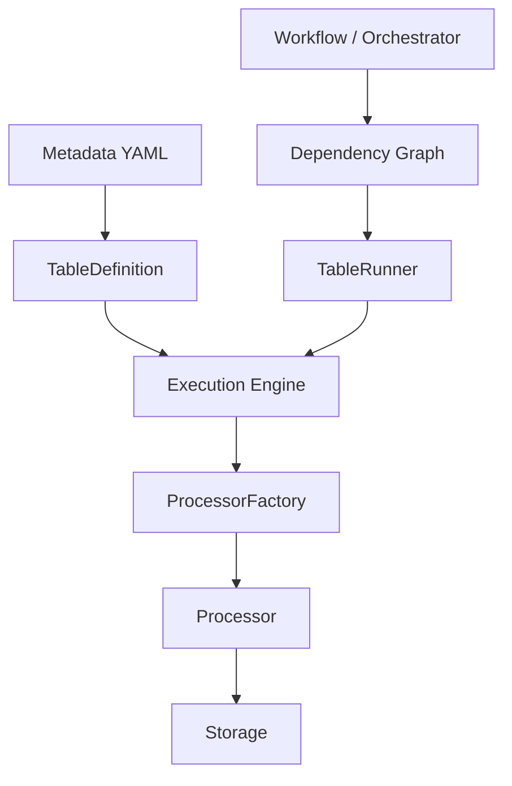
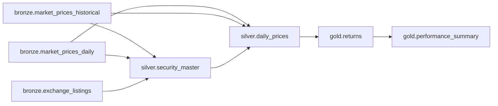
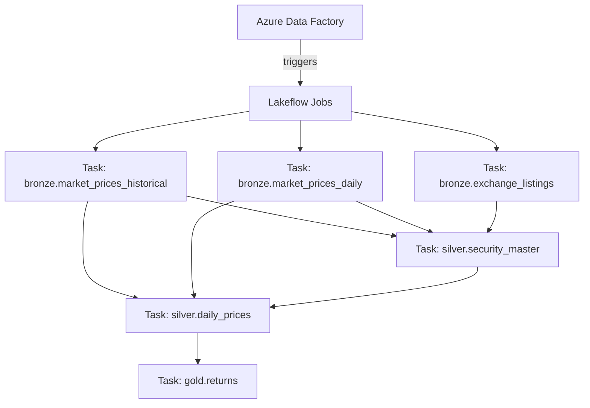

# platform_name

A metadata-driven, layered (Medallion) data platform **framework**, with a
small example domain (market prices / returns) used only to demonstrate it.

The framework is domain-agnostic: enterprise teams add tables by writing
**metadata + a processor**, never by modifying the engine.

```
pip install -e .
pytest
```

Want to try the PySpark/SQL tables without installing a JVM or DuckDB
yourself? `docker compose run --rm dev python scripts/local_dev_pipeline.py`
— see [`docs/PYSPARK_AND_SQL_GUIDE.md`](docs/PYSPARK_AND_SQL_GUIDE.md).

> **New to the codebase?** [`docs/TUTORIAL.md`](docs/TUTORIAL.md) is a full
> onboarding walkthrough: how the engine works end to end, a deep dive into
> every module, and a hands-on tutorial for adding your first table.
>
> **Need PySpark or SQL for a table's transformation logic instead of
> Pandas?** [`docs/PYSPARK_AND_SQL_GUIDE.md`](docs/PYSPARK_AND_SQL_GUIDE.md)
> covers writing and running both, locally and in production, with the
> same processor code either way.
>
> **Deploying to Databricks + ADF?** [`docs/DEPLOYMENT.md`](docs/DEPLOYMENT.md)
> covers the production execution model: one Lakeflow Jobs task per
> table (generated from the same metadata `TableRunner` uses locally), the
> CI/CD pipeline, and why this keeps production triage in the Databricks UI
> instead of requiring framework knowledge. ("Lakeflow Jobs" is Databricks'
> current name — as of the 2025/2026 Lakeflow unification — for what was
> previously called Databricks Workflows; the underlying Jobs API and Asset
> Bundle task/`depends_on` structure this repo targets is unchanged.)

```python
from platform_name.common.config import Config
from platform_name.engine.models import ExecutionContext
from platform_name.engine.runner import TableRunner

config = Config("configs/environments/dev.yaml")
context = ExecutionContext(config=config)
runner = TableRunner()

result = runner.run(table_name="gold.returns", context=context)
print(result.to_dict())
```

This automatically executes, in order:

```
bronze.market_prices_historical ─┐
bronze.market_prices_daily      ─┼→ silver.security_master → silver.daily_prices → gold.returns
bronze.exchange_listings        ─┘
```

---

## 1. Architectural principle

Metadata describes **WHAT** a table is and **HOW** it should execute.
Processors contain **business logic**. The engine **orchestrates**
execution. Workflows control **scheduling and dependency order**.
Infrastructure controls **where** execution happens.



The most important rule in the codebase:

> **A dependency name never determines a constructor argument.**
> `dependencies: [silver.daily_prices]` means *"run this first"* — nothing
> about constructor wiring. Constructor parameters are always resolved from
> an explicit `parameter:` key under `paths:` in metadata. See
> `tests/architecture/test_no_hardcoding.py`, which statically scans the
> generic engine modules for business-specific vocabulary and behaviorally
> proves a brand-new table can be added without touching the engine.

## 2. Repository structure

```
configs/environments/{dev,test,prod}.yaml   # environment-specific path roots
src/platform_name/
    common/            # Config, exceptions
    engine/            # enums, TableDefinition, registry, loader, factory,
                        # dependency graph, runner, architecture validator
    contracts/         # DatasetContract model + concrete example contracts
    quality/           # reusable data-quality validation framework
    storage/           # StorageAdapter interface + local filesystem impl
    tables/            # BaseProcessor + example bronze/silver/gold processors,
                        # each table as tables/<layer>/<table>/{metadata.yaml, processor.py}
    entrypoints/       # run_single_table.py: production single-table entry point
    deploy/            # bundle_generator.py: metadata -> Databricks job definition
    observability/     # pluggable ExecutionResult sinks
tests/
    unit/              # Config, models, registry, loader, factory, graph, contracts
    processors/        # each example processor in isolation
    integration/        # full bronze → gold pipeline runs
    architecture/       # no-hardcoding + metadata-validity checks
    deploy/             # bundle generator + single-table entry point tests
data/{landing,bronze,silver,gold}/          # local dev data
```

Metadata lives **colocated with its processor**, one directory per table
(`tables/<layer>/<table>/metadata.yaml` + `processor.py`) — not in a
separate top-level tree. A new engineer adding a table only ever needs to
look in one place.

## 3. Metadata model

Every table has one `metadata.yaml`, living next to its `processor.py`.
Example (`src/platform_name/tables/gold/returns/metadata.yaml`):

```yaml
name: returns
layer: gold
execution:
  mode: pandas
load:
  strategy: full
dependencies:
  - silver.daily_prices
processor:
  module: platform_name.tables.gold.returns.processor
  class: GoldReturnsProcessor
paths:
  input:
    file: daily_prices.parquet
    root: silver
    parameter: prices_path
  output:
    file: returns.parquet
```

Two concepts are kept strictly separate:

| Concept | Meaning | Where declared |
|---|---|---|
| `dependencies` | lineage / scheduling order only | `dependencies:` |
| `paths.<entry>.parameter` | physical path → constructor kwarg | `paths:` |

`load.strategy` (full/incremental/upsert/scd1/scd2) is likewise kept
separate from the physical `write_mode` (overwrite/append/merge) it implies.

## 4. Processor model

```python
class BaseProcessor:
    def read(self): ...
    def transform(self, data): ...
    def validate(self, data): return data
    def write(self, data): ...
    def run(self):
        data = self.read()
        data = self.transform(data)
        data = self.validate(data)
        self.write(data)
        return data
```

Processors declare whatever constructor parameters make sense for their
business logic (`bronze_path`, `security_master_path`, `prices_path`, ...).
`ProcessorFactory` resolves and injects them purely from metadata — it has
no knowledge of what those names mean.

## 5. Dependency model



`DependencyGraph.resolve("gold.returns")` topologically sorts this into
execution order, detects cycles, missing dependencies, and layer-ordering
violations (a table may not depend on a *later* medallion layer).

## 6. Configuration & environments

`Config` loads one environment YAML (`configs/environments/{dev,test,prod}.yaml`)
exposing `landing`/`bronze`/`silver`/`gold` root paths plus arbitrary config.
The same table metadata runs unchanged across environments — only the path
roots differ, e.g. local `data/bronze` in dev vs. `abfss://...` in prod.

## 7. Data quality

`DatasetContract` (columns, dtypes, nullability, uniqueness, business keys,
min row count) + `validate_dataset_contract(df, CONTRACT)` are reusable by
any processor at any layer. See `platform_name.contracts.definitions` for
the example domain's contracts (`SECURITY_MASTER_CONTRACT`, etc.).

## 8. Local execution

```
pip install -e .
pytest
```

Runs entirely against Pandas and the local filesystem, using deterministic,
self-contained test fixtures (`tests/conftest.py`) — no network access or
external services required.

## 9. Databricks deployment concept

`TableRunner`, `ProcessorFactory`, `TableDefinition`, and `ExecutionContext`
are not coupled to Pandas or the local filesystem:

* `ExecutionMode.PYSPARK` and `ExecutionMode.SQL` are implemented, not just
  defined: `tables/pyspark_base.py` (`BasePySparkProcessor`),
  `tables/sql_base.py` (`BaseSqlProcessor`), and `storage/delta.py`
  (`DeltaStorageAdapter`) exist and are tested. `ProcessorFactory` injects
  a live `spark` session into any `pyspark`/`sql`-mode table's constructor
  automatically, based only on `execution_mode` — never a table name. The
  example domain stays 100% Pandas by design (so the default install and
  test suite never require PySpark); see
  [`docs/PYSPARK_AND_SQL_GUIDE.md`](docs/PYSPARK_AND_SQL_GUIDE.md) for how
  to write and run a real PySpark or SQL table, locally and in production.
* `ExecutionContext.spark` already carries an optional `SparkSession`.
* A production `configs/environments/prod.yaml` points path roots at ADLS
  Gen2 / Unity Catalog locations instead of local `data/` directories —
  no metadata changes required.

`TableRunner` itself is what runs locally and in CI — resolving and
executing a whole dependency chain in one process. **Production does not
run `TableRunner` directly.** Instead, `src/platform_name/deploy/bundle_generator.py`
compiles the same `TableRegistry`/`DependencyGraph` into a Databricks
Workflow with **one task per table**, each running
`src/platform_name/entrypoints/run_single_table.py --table <name>` — a
single-table entry point that lets Databricks own ordering, retries, and
per-task observability natively, rather than a whole chain failing/retrying
as one unit. See [`docs/DEPLOYMENT.md`](docs/DEPLOYMENT.md) for the full
rationale and the CI/CD pipeline that generates and deploys this.



Every task box runs the same generic `run_single_table.py` script with a
different `--table` parameter — none of it is table-specific code.

## 10. ADF orchestration concept

ADF is treated purely as an **orchestration layer** that triggers the
generated Lakeflow Jobs job — it never becomes a reimplementation of the
dependency graph or execution engine. The dependency graph itself is
compiled once, from metadata, into the job's task `depends_on` edges
(see `bundle_generator.py`) — it is never hand-maintained a second time in
ADF or in Lakeflow Jobs' UI.

## 11. Extension strategy

New tables are added by creating one new directory:

1. `src/platform_name/tables/<layer>/<table>/metadata.yaml`
2. `src/platform_name/tables/<layer>/<table>/processor.py`
3. Tests

**No generic engine file needs to change.** This is verified directly in
`tests/architecture/test_no_hardcoding.py::test_adding_a_new_table_requires_no_generic_engine_changes`,
which adds a `gold.customer_risk` table with a brand-new constructor
parameter (`risk_input_path`) purely through metadata + a processor module.

Future extensions (Delta Lake, Unity Catalog, ADLS/S3 adapters, CDC, SCD1/2
physical implementations, retries, partitioning, lineage/catalog
integration, etc.) plug into the same seams: new `StorageAdapter`
implementations, new `ExecutionMode` handling in processor base classes, and
new `LoadStrategy`/`WriteMode` handling in processors — the registry,
factory, graph, and runner do not need to change as the table count grows
from 10 to 1000+.
