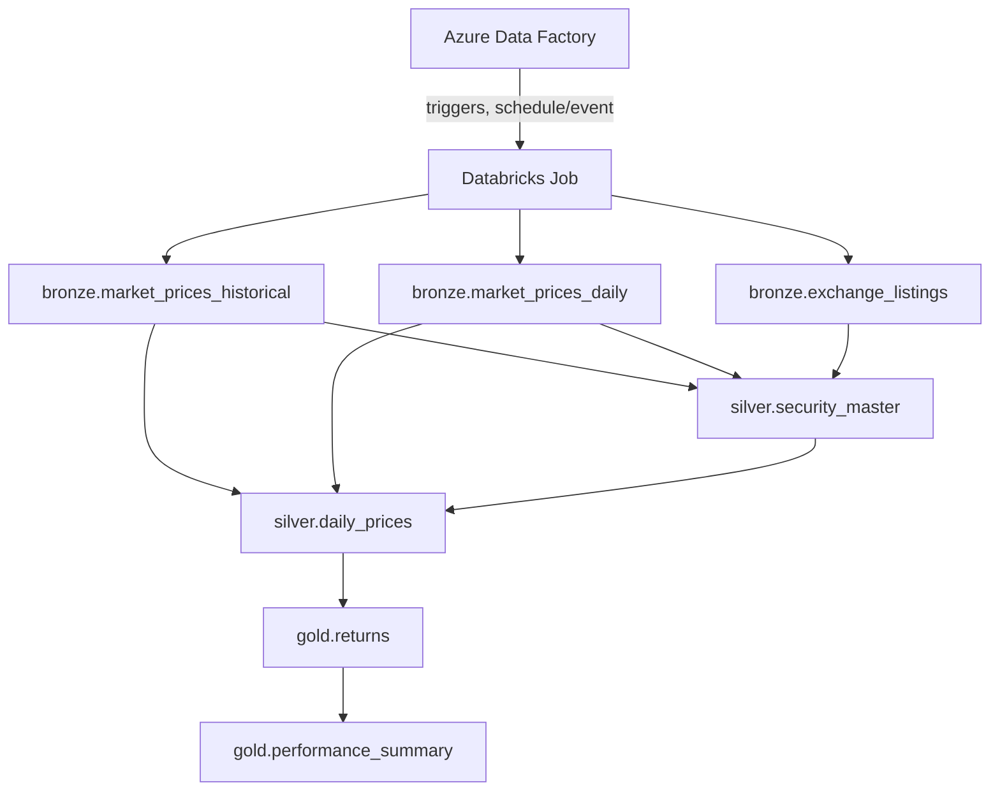

# Deployment: ADF + Databricks Asset Bundles

This document explains how the framework goes from "metadata + a processor
on a laptop" to "a production Lakeflow Jobs job, one task per table,
triggered by ADF." If you haven't read
[`docs/TUTORIAL.md`](TUTORIAL.md) yet, do that first — this document
assumes you understand `TableRegistry`, `DependencyGraph`, and
`ProcessorFactory` already.

> **A naming note.** Databricks renamed "Databricks Workflows" to
> **Lakeflow Jobs** as part of the 2025/2026 Lakeflow unification (which
> also introduced Lakeflow Declarative Pipelines and Lakeflow Connect —
> see the "Recent and optimal solution" discussion this document builds
> on). The underlying Jobs API, and the Asset Bundle `task_key`/`depends_on`
> structure `bundle_generator.py` emits, are unchanged — only the product
> name changed. This document uses "Lakeflow Jobs" throughout.

## Why this exists

Running `TableRunner.run("gold.returns", context)` locally resolves and
executes an entire upstream chain in one Python call. That's the right tool
for development, CI, and fast iteration. It is **not** the right tool for
production support: if `silver.daily_prices` fails three tables into a
chain, a single Python traceback doesn't give on-call support a
per-table retry button, a per-table SLA, or a UI that shows *which* table
failed without reading a stack trace.

So in production, a different (but metadata-compiled, never hand-written)
execution path takes over: **one Lakeflow Jobs task per table**,
ordering enforced natively by Databricks, each task running exactly one
table via a thin entry point script. See
[`docs/TUTORIAL.md`](TUTORIAL.md) and the conversation that led here for
the full triage rationale — the short version is: a failed task shows red
in the Databricks UI, gets retried on its own via "Repair run," and support
never needs to open this repository's source code to do that.



Every one of those task boxes runs the **same** generic script
(`run_single_table.py`) with a different `--table` parameter. None of them
is table-specific code — the table name is a runtime argument, not a
different entry point per table.

## The two new pieces

### 1. `platform_name/entrypoints/run_single_table.py`

The production entry point. Given `--table gold.returns --env prod`, it:

1. Loads `configs/environments/prod.yaml`.
2. Loads the metadata registry and looks up `gold.returns`.
3. Builds the processor via the same `ProcessorFactory` used everywhere
   else in the framework.
4. Runs it, records a structured `ExecutionResult`, and prints it as one
   JSON line (`StdoutResultSink`) — captured automatically by the
   Databricks task's log, so triage never requires more than opening that
   task in the UI.
5. Exits non-zero on failure, which is what makes the Databricks task show
   red.

Critically, **it does not resolve a dependency chain**. It runs exactly the
one table it was told to run. Ordering is Lakeflow Jobs' job, not
this script's — that's what makes independent per-task retries safe.

```bash
python -m platform_name.entrypoints.run_single_table \
    --table gold.returns --env prod
```

### 2. `platform_name/deploy/bundle_generator.py`

Reads the same `TableRegistry` + `DependencyGraph` that `TableRunner` uses
locally, and compiles them into a Databricks Asset Bundle job resource —
one task per table, `depends_on` wired directly from each table's
`dependencies:` in metadata, every task pointing at the same
`run_single_table` entry point with a different `--table` value.

```bash
python -m platform_name.deploy.bundle_generator --output resources/tables_job.yml
```

No `--metadata-root` argument is needed: metadata lives colocated with its
processor, one directory per table
(`src/platform_name/tables/<layer>/<table>/metadata.yaml`), and the
generator's default resolves relative to the installed package rather than
a separate top-level directory. This has a second, less obvious benefit —
see the packaging note below.

This is why the two execution paths (local `TableRunner`, production
Workflow) can never drift apart: they are compiled from the exact same
objects. There is nowhere for a second, hand-maintained copy of the
dependency graph to live.

**`resources/tables_job.yml` is a generated build artifact.** It is
regenerated by CI on every run (see below) and is `.gitignore`d — never
edit it by hand, and don't be surprised it's absent from a fresh checkout.

## Why Databricks Asset Bundles

Three ways to deploy a Databricks job exist: Databricks Asset Bundles
(DABs), Terraform's `databricks` provider, and the raw Jobs API. This
repository uses **Asset Bundles** by default:

- It keeps the same philosophy as the rest of the framework — metadata
  generates a deployment artifact, the same way metadata already generates
  `TableDefinition` objects.
- `databricks.yml`'s `targets:` block maps directly onto this repo's
  existing `configs/environments/{dev,test,prod}.yaml` split.
- It's git-native and has a fast `validate` → `deploy` loop, which matters
  when "add one table" should be a small, fast change to ship.

**If your organization already manages the Databricks workspace (and
ADF, ADLS, networking, etc.) via Terraform**, prefer that instead for a
single audit trail across all your Azure infrastructure. The change is
localized: `bundle_generator.py`'s `build_task_definitions()` /
`build_job_resource()` functions return plain Python dicts describing the
job shape — only `render_yaml()` (and the file extension/location it
writes to) would need to change to emit a `databricks_job` Terraform
resource instead of Asset Bundle YAML. Nothing about how the registry or
dependency graph is walked changes.

## Repository layout added for deployment

```
databricks.yml                          # Asset Bundle root config (hand-maintained)
resources/.gitkeep                      # resources/tables_job.yml is generated, not committed
azure-pipelines.yml                     # CI/CD pipeline (see below)
src/platform_name/
    entrypoints/run_single_table.py     # production single-table entry point
    deploy/bundle_generator.py          # metadata -> Databricks job definition
    observability/result_sink.py        # pluggable ExecutionResult sinks
tests/deploy/
    test_bundle_generator.py
    test_run_single_table.py
```

### Why metadata lives inside the package, and why that matters here

Metadata is colocated with its processor
(`src/platform_name/tables/<layer>/<table>/metadata.yaml`) rather than in a
separate top-level `metadata/` directory. Beyond the developer-experience
win (one directory to look in per table), this fixes a real production
packaging gap: `pyproject.toml` declares
`[tool.setuptools.package-data]` for `tables/**/metadata.yaml`, so every
`metadata.yaml` ships **inside the built wheel**. Once that wheel is
installed on a Databricks cluster (via the `artifacts`/`libraries` section
of the generated job), `TableRegistry`'s default root resolves correctly
relative to the installed package — there is no separate step to deploy a
`metadata/` directory to the workspace or DBFS alongside the code. Had
metadata stayed in a top-level directory outside the package, it would
never have made it onto the cluster at all without extra, easy-to-forget
deployment plumbing.

## The full pipeline (`azure-pipelines.yml`)

**On every pull request:** install, lint, run the full `pytest` suite
(including `tests/architecture/`, which now also checks the generator
itself for business-specific hardcoding), run the same
`ArchitectureValidator` pre-flight check as a standalone step, regenerate
`resources/tables_job.yml`, and run `databricks bundle validate` against
the `dev` target. Nothing is deployed. A PR that adds a new table shows up
as a diff of exactly one new task in the generated YAML — an easy, focused
review.

**On merge to `main`:** the same generate-and-validate step runs again,
then:

1. **Deploy to `dev`** automatically, followed by a smoke run of the whole
   pipeline against dev data (`databricks bundle run ... -t dev`).
2. **Deploy to `test`** (your staging/pre-prod environment) behind a manual
   approval gate — configure this as an Azure DevOps *Environment* with an
   approval check attached, rather than in the YAML itself.
3. **Deploy to `prod`** behind its own approval gate, running as a service
   principal (`run_as.service_principal_name` in `databricks.yml`) rather
   than a human identity.

If your team uses GitHub Actions instead of Azure DevOps, the stage
structure translates directly: each `stage` becomes a `job`, each
`deployment: environment:` gate becomes a GitHub *Environment* with
required reviewers, and the `script:` steps are unchanged (they're plain
`databricks` CLI / `python` invocations either way).

## Promoting a new table to production, concretely

Picking up the lifecycle from the earlier walkthrough, this is what
actually executes at each stage:

1. **Local** — a new directory
   `tables/gold/customer_risk/{metadata.yaml, processor.py}`, tested with
   `TableRunner.run("gold.customer_risk", ...)` against `dev.yaml`.
2. **PR** — CI regenerates `resources/tables_job.yml`; the diff shows one
   new `gold__customer_risk` task with a `depends_on` edge to whatever it
   declared in `dependencies:`. Reviewers read a task diff, not a
   400-line YAML file.
3. **Merge** — dev deploy + smoke run exercises the new task for real,
   against dev data, before anyone touches test or prod.
4. **Approval → test → approval → prod** — the identical generated job
   definition is promoted, only the target (and therefore the
   `environment` variable and path roots it resolves against) changes.
5. **Running in prod** — ADF triggers the Databricks job on schedule; the
   new task runs as `run_single_table.py --table gold.customer_risk --env
   prod`, writes its output, and Unity Catalog picks up its lineage
   automatically from the read/write it performed.

## What's intentionally not built yet

- **Idempotent retries for `upsert`/`scd1`/`scd2` load strategies specifically.**
  `bronze.market_prices_daily` is a real, working example of an idempotent
  incremental table — retrying it re-fetches from the last ingested date
  and de-duplicates on `(ticker, trade_date)`, so a repeated run never
  double-counts a row. That pattern doesn't yet exist for `upsert`/`scd1`/
  `scd2` tables: before one of those goes to production behind the same
  "Repair run" retry story, its processor needs to tolerate being
  re-applied — `DeltaStorageAdapter.merge_into()` exists as the primitive
  to build that on, but no processor calls it yet. Retrying a
  partially-applied upsert without that guarantee can silently
  double-apply changes.
- **`bronze.market_prices_daily` needs the `ingestion` extra on the actual
  Databricks cluster.** `pip install -e ".[ingestion]"` (or add `yfinance`
  to the cluster's library list) — without it, that one table's task fails
  at `read()` with a clear `ModuleNotFoundError`, not silently.
- **`DeltaResultSink`.** `StdoutResultSink` (captured by Databricks task
  logs) is enough to triage a single failure. Trend analysis across weeks
  of runs (row-count drift, duration drift) wants `ExecutionResult` rows
  queryable as a table — `observability/result_sink.py` documents exactly
  how to wire that once a `SparkSession` is available inside a real job.
- **A real PySpark/SQL table in the shipped example domain, and
  `prod.yaml` pointed at real ADLS/Unity Catalog paths.** The execution
  path itself is implemented and tested (`BasePySparkProcessor`,
  `BaseSqlProcessor`, `DeltaStorageAdapter` — see
  [`docs/PYSPARK_AND_SQL_GUIDE.md`](PYSPARK_AND_SQL_GUIDE.md)), but the
  shipped example domain stays 100% Pandas against `LocalFileSystemStorage`
  by design, so the default install and test suite never require PySpark.
  The first real table your team adds against real data is what proves
  this end to end against actual ADLS/Unity Catalog locations.
