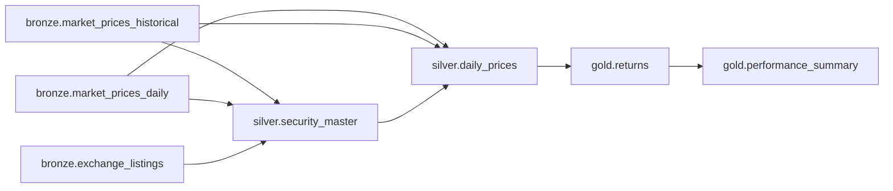
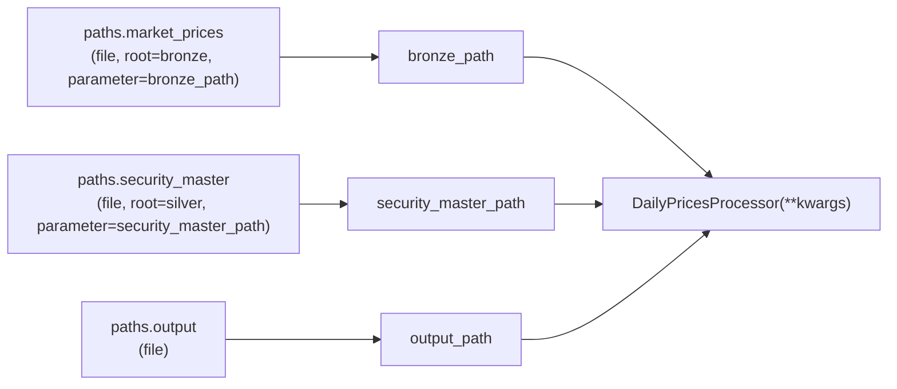
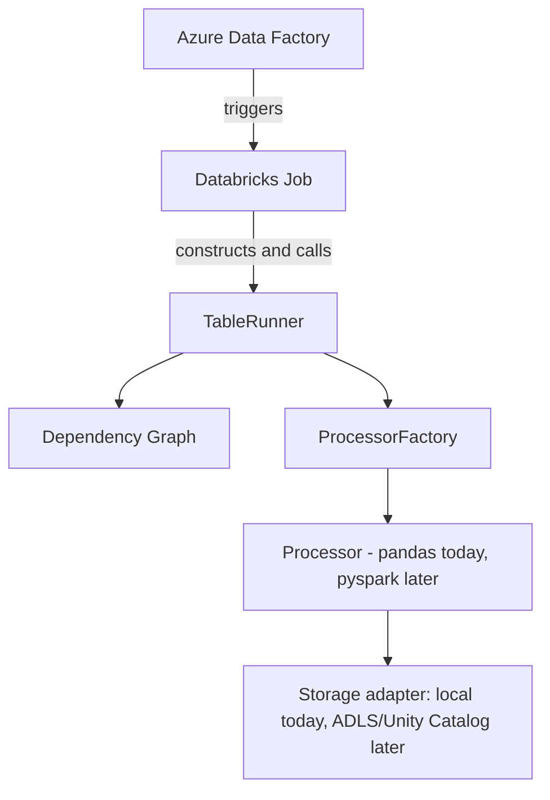

# Welcome to `platform_name` — an Onboarding Tutorial

*If you're reading this on your first day working on the platform, this doc
is for you. By the end, you should understand what problem this framework
solves, how every piece fits together, and be able to add a brand new table
to the platform yourself, confidently, without touching any core engine
code.*

---

## Table of Contents

1. [The problem this framework solves](#1-the-problem-this-framework-solves)
2. [The core mental model](#2-the-core-mental-model)
3. [A guided tour of the repository](#3-a-guided-tour-of-the-repository)
4. [How a single table run actually works, end to end](#4-how-a-single-table-run-actually-works-end-to-end)
5. [Deep dive: each module, one at a time](#5-deep-dive-each-module-one-at-a-time)
6. [Tutorial: add a brand new table yourself](#6-tutorial-add-a-brand-new-table-yourself)
7. [Data quality: how contracts protect the pipeline](#7-data-quality-how-contracts-protect-the-pipeline)
8. [Testing philosophy](#8-testing-philosophy)
9. [Why this design scales in an enterprise setting](#9-why-this-design-scales-in-an-enterprise-setting)
10. [From your laptop to Databricks + ADF](#10-from-your-laptop-to-databricks--adf)
11. [Common mistakes and anti-patterns to avoid](#11-common-mistakes-and-anti-patterns-to-avoid)
12. [Glossary](#12-glossary)
13. [Cheat sheet](#13-cheat-sheet)

---

## 1. The problem this framework solves

Most data platforms start simple: a handful of scripts that read some files
and write some other files. Then the company grows. More tables. More
teams. More dependencies between tables. Before long you have one of two
failure modes:

- **A tangle of bespoke scripts** — every table has its own ad-hoc script,
  with its own conventions, its own error handling, its own idea of what
  "environment" means. Onboarding a new engineer takes weeks because there
  is no consistent pattern to learn.
- **A "smart" framework that got too smart** — someone built a generic
  runner, but under the hood it's full of code like:

  ```python
  if table_name == "daily_prices":
      kwargs["prices_path"] = dependency_path
  ```

  This looks convenient at first (less YAML to write!) but it means the
  *framework itself* grows a new `if` branch every time someone adds a
  table. At 50 tables this is unpleasant. At 500 tables it's the single
  biggest source of production incidents, because nobody can safely change
  the framework without risking every existing table.

`platform_name` is built to avoid both failure modes. The rule that
everything else follows from:

> **Metadata describes WHAT a table is and HOW it should execute. Processors
> contain the business logic. The engine only orchestrates. It never knows
> anything about any specific table.**

If you remember only one sentence from this document, remember that one.
Everything below is really just an elaboration of it.

## 2. The core mental model

There are two graphs you should picture whenever you think about this
platform, and it's important to keep them separate in your head.

**Graph 1 — the "what depends on what" graph** (business/lineage concept):



This is declared with `dependencies:` in metadata. It answers exactly one
question: *"what must run before this table, and in what order?"* It has
**nothing to do with function arguments.**

**Graph 2 — the "how do I build this processor" mapping** (plumbing
concept):



This is declared with `paths:` in metadata, and it answers a completely
different question: *"what physical file does this processor need, and what
should I call it when I hand it to the constructor?"*

**Why keep these separate?** Because they don't always line up 1:1. A table
might depend on another table purely for scheduling purposes (e.g. "don't
run me until the reference data refresh finishes") without ever touching
its output file directly. Or a processor might need an input file that
comes from a table it doesn't formally "depend" on (rare, but the framework
doesn't forbid it — you'd just be responsible for the lineage accuracy).
Conflating the two graphs is exactly what leads to the `if table_name ==`
anti-pattern, because the framework starts trying to be clever about
inferring one from the other.

## 3. A guided tour of the repository

```
configs/environments/{dev,test,prod}.yaml   # WHERE data lives per environment
src/platform_name/
    common/
        config.py          # loads + validates one environment YAML
        exceptions.py       # every error type in the system
    engine/
        enums.py            # Layer, ExecutionMode, LoadStrategy, WriteMode
        models.py           # TableDefinition, ExecutionContext, ExecutionResult
        metadata_loader.py  # YAML -> validated TableDefinition
        table_registry.py   # discovers + holds all TableDefinitions
        processor_loader.py # dynamically imports a processor class
        processor_factory.py# resolves paths -> constructor kwargs, builds processor
        dependency_graph.py # topological sort, cycle/lineage validation
        runner.py           # TableRunner: orchestrates a full run
        validation.py       # ArchitectureValidator: fail-fast pre-flight checks
    contracts/
        base.py             # DatasetContract / ColumnContract model
        definitions.py      # concrete contracts for the example domain
    quality/
        framework.py        # validate_dataset_contract(df, CONTRACT)
    storage/
        base.py             # StorageAdapter interface
        local.py             # local filesystem implementation
    tables/
        base.py              # BaseProcessor (read/transform/validate/write/run)
        bronze/market_prices/{metadata.yaml, processor.py}
        silver/security_master/{metadata.yaml, processor.py}
        silver/daily_prices/{metadata.yaml, processor.py}
        gold/returns/{metadata.yaml, processor.py}
        gold/performance_summary/{metadata.yaml, processor.py}
tests/
    unit/           # one file per engine component, no I/O beyond tmp_path
    processors/     # each example processor tested in isolation
    integration/    # full bronze -> gold pipeline runs
    architecture/   # "no hardcoding" + metadata validity checks
data/{landing,bronze,silver,gold}/  # local dev data (landing/ has sample CSV)
```

Notice `metadata.yaml` sits **right next to `processor.py`**, one directory
per table (`tables/<layer>/<table>/`). This is deliberate: a new engineer
adding a table only ever needs to look in one place, not hunt between a
separate top-level `metadata/` tree and a parallel `tables/` tree that used
to be kept in sync by convention alone. The directory structure itself is
now part of the validation — `tables/<layer>/<table>/metadata.yaml`'s
`name:` and `layer:` fields must match their own directory and parent
directory names, which is exactly the kind of copy-paste mistake ("I
duplicated an existing table's folder and forgot to rename the `name:`
field inside it") this catches automatically.

A useful way to think about this tree: **everything under `engine/` is
"the framework"** — code you should rarely need to touch. **Everything
under `tables/` and `contracts/definitions.py`** is "the example domain" —
code that grows every time someone adds a table, and which you *will*
touch constantly. The whole point of the architecture is to keep that
second category from ever requiring changes to the first.

## 4. How a single table run actually works, end to end

Let's trace exactly what happens when you run:

```python
from platform_name.common.config import Config
from platform_name.engine.models import ExecutionContext
from platform_name.engine.runner import TableRunner

config = Config("configs/environments/dev.yaml")
context = ExecutionContext(config=config)
runner = TableRunner()

result = runner.run(table_name="gold.returns", context=context)
```

Step by step:

1. **`TableRunner()`** is constructed with no arguments. Internally it
   defaults `metadata_root` to the installed `platform_name.tables`
   package and immediately builds a `TableRegistry`, which walks that
   directory tree, parses every `metadata.yaml` file it finds via
   `metadata_loader.py`, and validates each one (correct layer, correct
   enum values, well-formed `paths`, directory structure matching the
   `name:`/`layer:` fields, etc.). If any file is broken, you find out
   **now**, before any data moves.

2. **`runner.run("gold.returns", context)`** asks its `DependencyGraph` to
   resolve `gold.returns`. The graph does a depth-first walk over
   `dependencies:` fields and returns:

   ```
   ["bronze.market_prices_historical", "bronze.market_prices_daily", "bronze.exchange_listings", "silver.security_master", "silver.daily_prices", "gold.returns"]
   ```

   (The three bronze tables have no dependencies among each other, so
   their relative order among themselves isn't fixed — only that all
   three run before `silver.security_master`.)

   If there were a cycle, or a dependency pointing at a table that doesn't
   exist, or a table depending on something in a *later* medallion layer,
   this step raises a `DependencyGraphError` right here — before anything
   executes.

3. For **each table in that order**, the runner:
   - Looks up its `TableDefinition` in the registry.
   - Starts an `ExecutionResult` (records `start_time`, `run_id`, etc.).
   - Hands the definition to a `ProcessorFactory`, which:
     - Dynamically imports the processor module/class named in metadata
       (`processor_loader.py`).
     - Resolves every entry under `paths:` into `str(Path)` values, using
       `config.layer_root(...)` to find the right root for the current
       environment.
     - Merges in any `processor_config` values (e.g. `source: historical`).
     - Inspects the processor's `__init__` signature and checks every
       *required* (no-default) parameter is covered by what was resolved.
       If not, it raises a `ProcessorConstructionError` that tells you
       exactly which arguments are missing and which were supplied —
       no guessing from a stack trace.
     - Instantiates the processor.
   - Calls `processor.run()`, which (by default, via `BaseProcessor`) does
     `read() -> transform() -> validate() -> write()`.
   - Records success (with a row count, if determinable) or failure on the
     `ExecutionResult`, and stores it in
     `context.extra["execution_results"][table_name]`.

4. If you now call `runner.run("gold.performance_summary", context)` in the
   **same context**, the runner sees that the three bronze tables,
   `silver.security_master`, `silver.daily_prices`, and `gold.returns`
   already have results recorded in this context and **skips re-running
   them** (pass `force_rerun=True` if you want to force it). Only
   `gold.performance_summary` executes.

5. The function returns the `ExecutionResult` for the table you asked for.
   Every intermediate result is still available via
   `context.extra["execution_results"]` for logging/observability.

That's the entire lifecycle. Notice that at no point did the runner, the
graph, the registry, or the factory need to know what "returns" or "daily
prices" *mean*. They only ever manipulated strings, paths, and Python
objects generically.

## 5. Deep dive: each module, one at a time

### `common/config.py` — `Config`

Loads a single environment YAML (`configs/environments/dev.yaml`, etc.),
validates it has an `environment` key and a `paths` mapping with all four
layer roots (`landing`, `bronze`, `silver`, `gold`), and exposes:

```python
config.environment        # "dev"
config.paths               # {"landing": "...", "bronze": "...", ...}
config.layer_root("bronze") # "data/bronze"
config.get("market_data.source")  # dotted-path lookup into arbitrary config
```

This is the *only* place environment differences live. The same
`tables/**/metadata.yaml` files are read in dev, test, and prod — only the
roots returned by `layer_root()` differ (local folders in dev,
`abfss://...` URLs in prod, for example).

### `engine/enums.py`

Four small `str` Enums: `Layer`, `ExecutionMode`, `LoadStrategy`,
`WriteMode`. Using `str` Enums means the raw string in YAML (`"pandas"`,
`"upsert"`) round-trips cleanly while still giving you validation and
autocomplete in Python code.

Notice `LoadStrategy` (a *logical* concept: full/incremental/upsert/scd1/
scd2 — "how should new data reconcile with old data?") is a **separate**
enum from `WriteMode` (a *physical* concept: overwrite/append/merge —
"what write mechanism actually realizes that?"). A table's `load.strategy`
might be `upsert` while, depending on the storage engine, the `write_mode`
used to implement that upsert could be `merge` (Delta/SQL `MERGE`) today or
`overwrite` (recompute-and-replace, as our example Pandas processors do)
until a Delta-backed processor is written.

### `engine/models.py`

- **`TableDefinition`** — an immutable (`frozen=True`) dataclass. This is
  the canonical, validated representation of one row of metadata. It has
  `fully_qualified_name` (`"gold.returns"`) and a `full_name` alias for the
  same thing. It carries *only* data — no methods that do I/O or business
  logic.
- **`ExecutionContext`** — the "bag of runtime stuff" threaded through a
  run: which `Config`, which environment, a `run_id` (auto-generated UUID),
  an optional `spark` session (for future PySpark execution — `None`
  locally), and a free-form `extra` dict (this is where the runner stashes
  `execution_results`).
- **`ExecutionResult`** — a structured record of one table's execution:
  status, timestamps, row count, error message. `to_dict()` gives you
  something you can log as JSON or ship to a metrics system.

### `engine/metadata_loader.py`

Parses and validates one YAML file into a `TableDefinition`. This is where
*every* metadata validation rule lives: required keys, valid enum values,
well-formed `dependencies` (must be `layer.table` strings referencing a
real layer), well-formed `paths` (each entry needs `file` or `directory`,
non-output entries need `root`, roots must be real layers), and the rule
that the file must be named exactly `metadata.yaml`, living at
`tables/<layer>/<table>/metadata.yaml`, where the directory name matches
the `name:` field and the parent directory name matches the `layer:` field
(so `tables/silver/daily_prices/metadata.yaml` must contain
`name: daily_prices` and `layer: silver` — this stops a whole class of
copy-paste mistakes, like duplicating an existing table's folder to start
a new one and forgetting to update the fields inside it).

Every error raised here is a `MetadataError` with a `context` dict attached
(file path, offending value, list of valid values) so a broken pipeline
tells you exactly what to fix.

### `engine/table_registry.py`

Walks a metadata root (recursively, looking specifically for files named
`metadata.yaml`) and builds a `{fully_qualified_name: TableDefinition}`
map. Detects duplicate definitions (two files claiming to be
`gold.returns`, say) and raises immediately. Exposes `get()`, `has()`,
`list_tables()`, `list_by_layer()`, `all_names()`. **You never manually
register a table in Python** — dropping a new `metadata.yaml` next to a
processor under `tables/<layer>/<table>/` is enough for the registry to
pick it up.

### `engine/processor_loader.py` — `ProcessorLoader`

One job: given a `TableDefinition`'s `processor_module` /
`processor_class` strings, `importlib.import_module(...)` the module and
`getattr(...)` the class. Raises a clear `ProcessorLoadError` if the module
doesn't exist, the class doesn't exist in it, or metadata didn't declare a
processor at all. Never hardcodes any processor class name.

### `engine/processor_factory.py` — `ProcessorFactory`

This is the module worth understanding the best, because it's where the
"no hardcoding" rule is enforced most concretely. Its job, given a
`TableDefinition`:

1. **Resolve the output path.** `paths.output.file` is joined onto
   `config.layer_root(table.layer)` (or an explicit `root:` if one is
   given) and passed to the processor as `output_path`.
2. **Resolve every input path.** For each other entry under `paths:`, join
   its `file`/`directory` onto `config.layer_root(entry.root)`, and figure
   out what constructor keyword to call it:
   - If the entry declares `parameter: some_name`, use that verbatim. This
     is the expected, explicit path for every new table you write.
   - If it doesn't (legacy support only), fall back to a **generic** name
     — `landing_path` for a `landing`-rooted entry, otherwise `input_path`.
     Note this fallback *never* invents a business-specific name; it only
     ever produces one of these two generic names.
3. **Merge in `processor_config`** values (e.g. `source: historical`) as
   additional kwargs.
4. **Inspect the processor's `__init__` signature** with `inspect.signature`
   and check every required (no-default) parameter is covered. If not,
   raise `ProcessorConstructionError` listing exactly which arguments are
   missing and which were supplied.
5. **Instantiate** the processor with the resolved kwargs (filtering out
   anything the constructor doesn't accept, unless it has `**kwargs`).

Look closely at `build_constructor_arguments` and `create` in
`processor_factory.py` — you will never find a single reference to
`"daily_prices"`, `"prices_path"`, `"ticker"`, or any other business term.
This is enforced by an automated test
(`tests/architecture/test_no_hardcoding.py`) that scans the source of this
file (and the other generic engine modules) for exactly those forbidden
strings.

### `engine/dependency_graph.py` — `DependencyGraph`

Builds the dependency graph purely from `TableDefinition.dependencies`.
`resolve(table_name)` does a depth-first topological sort, raising
`DependencyGraphError` on:
- a dependency that isn't in the registry (`missing_dependency`),
- a cycle (reports the full cycle path, e.g.
  `silver.a -> silver.b -> silver.a`),
- a table depending on a table in a *later* medallion layer (checked in
  `validate()`, which additionally calls `resolve()` on every table in the
  registry so the whole graph is checked, not just one path).

The graph **never executes anything** — it only answers ordering questions.

### `engine/runner.py` — `TableRunner`

Ties the registry, graph, and factory together (see [section 4](#4-how-a-single-table-run-actually-works-end-to-end)
for the full walkthrough). The only "cleverness" here is result caching
within a single `ExecutionContext` (so running two gold tables that share
upstream dependencies in the same context doesn't redo work), and wrapping
any processor exception in an `ExecutionError` that names the table, the
`run_id`, and the underlying error, without swallowing the original
traceback (`raise ... from err`).

### `engine/validation.py` — `ArchitectureValidator`

A "fail fast, all at once" checker you'd run in CI or before a deployment.
Given a registry and config, it:
1. Validates the whole dependency graph (cycles, missing deps, layer
   ordering).
2. For every table, tries to dynamically load its processor class.
3. For every table, tries to resolve its constructor arguments from
   metadata + config (this catches "you forgot a `parameter:` mapping"
   mistakes **without needing any real data files to exist**).

It returns a `ValidationReport` with every error found (not just the
first), so a broken metadata change gets one comprehensive error report
instead of a whack-a-mole debugging session.

### `contracts/base.py` and `contracts/definitions.py`

`DatasetContract` is a generic, reusable shape: columns (with expected
dtype/nullability/uniqueness), required columns, business keys, and a
minimum row count. `contracts/definitions.py` then declares the concrete
contracts for *this* domain (`SECURITY_MASTER_CONTRACT`,
`DAILY_PRICES_CONTRACT`, etc.) — this file is explicitly **not** part of
the generic framework; a new business domain would add its own contracts
file rather than editing this one.

### `quality/framework.py`

`validate_dataset_contract(df, CONTRACT)` runs every check (required
columns, dtype, nullability, uniqueness, business-key uniqueness, row
count) and raises a single `DataQualityError` listing every violation
found, if any. Any processor, at any layer, can call this on its output (or
input) before writing.

### `storage/base.py` and `storage/local.py`

`StorageAdapter` is a `Protocol` (structural interface) describing
`read_parquet` / `write_parquet` / `read_csv` / `list_files` / `exists`.
`LocalFileSystemStorage` is the only implementation today. When ADLS Gen2
or S3 support is needed, a new adapter implementing the same five methods
is all that's required — no processor code changes.

### `tables/base.py` — `BaseProcessor`

```python
class BaseProcessor:
    def read(self): raise NotImplementedError
    def transform(self, data): raise NotImplementedError
    def validate(self, data): return data
    def write(self, data): raise NotImplementedError
    def run(self):
        data = self.read()
        data = self.transform(data)
        data = self.validate(data)
        self.write(data)
        return data
```

Every example processor overrides `read`/`transform`/`validate`/`write`
rather than `run` itself, which keeps each step independently unit
testable. You *can* override `run` directly for a processor whose logic
genuinely doesn't fit this shape — the engine only ever calls `.run()`.

## 6. Tutorial: add a brand new table yourself

Let's make this concrete. Say Risk wants a new gold table,
`gold.customer_risk`, built from `silver.daily_prices`, that computes a toy
risk score per security (say, absolute average daily return — purely for
this exercise). Here's exactly what you'd do, and nothing more.

**Everything for this table lives in one new directory:**
`src/platform_name/tables/gold/customer_risk/`. Create it and put both
files below inside it — that's the whole point of colocating metadata with
its processor: there's exactly one place to look, whether you're adding
the table or reviewing someone else's addition.

**File 1 — `processor.py`.**

```python
import pandas as pd

from platform_name.storage.local import LocalFileSystemStorage
from platform_name.tables.base import BaseProcessor


class CustomerRiskProcessor(BaseProcessor):
    def __init__(self, returns_path: str, output_path: str) -> None:
        self.returns_path = returns_path
        self.output_path = output_path
        self.storage = LocalFileSystemStorage()

    def read(self) -> pd.DataFrame:
        return self.storage.read_parquet(self.returns_path)

    def transform(self, data: pd.DataFrame) -> pd.DataFrame:
        return (
            data.dropna(subset=["daily_return"])
            .groupby("security_id")["daily_return"]
            .apply(lambda s: s.abs().mean())
            .reset_index(name="risk_score")
        )

    def write(self, data: pd.DataFrame) -> None:
        self.storage.write_parquet(data, self.output_path)
```

Don't forget an empty `__init__.py` in the same directory (or Python won't
treat it as a package).

**File 2 — `metadata.yaml`.**

The filename is always exactly `metadata.yaml` — never named after the
table — since the *directory* already tells you which table it is, and the
registry looks specifically for files with this name. The `name:` field
must match the directory it lives in (`customer_risk`), and `layer:` must
match its parent directory (`gold`) — the loader checks both and will tell
you immediately if either drifts.

```yaml
name: customer_risk

layer: gold

execution:
  mode: pandas

load:
  strategy: full

dependencies:
  - gold.returns

description: >
  Toy risk score per security, derived from daily returns.

processor:
  module: platform_name.tables.gold.customer_risk.processor
  class: CustomerRiskProcessor

paths:
  input:
    file: returns.parquet
    root: gold
    parameter: returns_path

  output:
    file: customer_risk.parquet

processor_config: {}
```

**Step 3 — run it.**

```python
result = runner.run(table_name="gold.customer_risk", context=context)
```

That's it. `TableRunner` re-uses `gold.returns` if it's already in the
context, otherwise it (and everything upstream of it) runs first. Nothing
in `engine/` changed. No one had to review a pull request that touched
`processor_factory.py`. This is precisely the "final architectural test"
this framework is designed to pass — see
`tests/architecture/test_no_hardcoding.py::test_adding_a_new_table_requires_no_generic_engine_changes`
for an automated version of exactly this exercise.

**Step 4 — write tests.** At minimum: a `tests/processors/test_customer_risk_processor.py`
that constructs the processor directly with `tmp_path` fixtures (see the
existing processor tests for the pattern). You don't need to add a new
metadata-validity test for this specific file —
`tests/architecture/test_metadata_validity.py` already validates every
`metadata.yaml` found anywhere under `src/platform_name/tables/`
automatically, so `gold/customer_risk/metadata.yaml` is covered the moment
it exists.

## 7. Data quality: how contracts protect the pipeline

Every example processor calls `validate_dataset_contract(df, CONTRACT)`
inside its `validate()` step, *before* writing. This means a silently
broken upstream change (say, a CSV column rename) fails loudly, at the
table that first produces bad data, with a specific list of violations —
not three layers downstream in a gold table with a confusing error.

```python
def validate(self, data: pd.DataFrame) -> pd.DataFrame:
    validate_dataset_contract(data, DAILY_PRICES_CONTRACT)
    return data
```

If you add a new table, define its contract in
`contracts/definitions.py` (or your own domain's equivalent file) and call
`validate_dataset_contract` the same way. The check runs against category
of dtype (string/datetime/integer/float/bool) rather than an exact pandas
dtype string, so it's robust to differences between pandas versions.

## 8. Testing philosophy

The test suite is organized to mirror the architecture itself:

- **`tests/unit/`** — one component at a time, no real files beyond
  pytest's `tmp_path`. If `Config` is broken, `test_config.py` fails; you
  don't need to run a whole pipeline to find that out.
- **`tests/processors/`** — each processor tested with hand-built,
  deterministic input DataFrames (no dependency on the shipped `data/`
  sample, and no network access).
- **`tests/integration/`** — the full `bronze → gold` chain, driven by the
  *real* shipped `tables/**/metadata.yaml` files plus a throwaway
  environment config pointed at `tmp_path` (see
  `tests/conftest.py::dev_environment`). This is the test that answers
  "does the whole thing actually work together?"
- **`tests/architecture/`** — the tests that keep the framework honest over
  time: they scan the generic engine source code for forbidden
  business-specific vocabulary, prove a new table can be added without
  engine changes, and validate every shipped metadata file plus a battery
  of intentionally-broken ones.

Run everything with:

```bash
pip install -e .
pytest
```

Everything is deterministic and self-contained — no internet access or
external services are required to run the suite.

## 9. Why this design scales in an enterprise setting

Picture the platform at 10 tables, then 100, then 1000:

| | Naive "smart" framework | `platform_name` |
|---|---|---|
| Adding a table | Add YAML *and* extend an `if/elif` chain in the engine | Add YAML + a processor file |
| Engine code size | Grows with table count | Stays roughly constant |
| Review risk of a new table | Touches shared engine code — reviewers must reason about every other table | Touches only new files — isolated blast radius |
| Onboarding a new engineer | Must learn the growing pile of special cases | Learns one metadata schema + one processor contract |
| Refactoring the engine | Risky — special cases may depend on undocumented behavior | Safe — engine has no table-specific behavior to accidentally break |
| Testing a new table | Must also test it didn't break the engine's `if` chain | Fully isolated: unit-test the processor, validate the metadata |

This is the concrete meaning of "the engine should remain relatively stable
while the metadata and processor ecosystem grows" (see the project's
design brief, section 47). It's also why `ArchitectureValidator` exists:
in a platform with hundreds of tables owned by many teams, a lightweight
CI check that every table's metadata is valid and every processor is
constructible — **before any data actually moves** — turns a 2am pipeline
failure into a rejected pull request.

## 10. From your laptop to Databricks + ADF

Nothing in this repository is Databricks-specific, and that's deliberate:

- `ExecutionMode.PYSPARK` and `ExecutionMode.SQL` already exist as enum
  values; today only `pandas` is implemented, but a Spark-backed processor
  base class (and a `StorageAdapter` for ADLS Gen2 / Unity Catalog) can be
  introduced without touching `TableRegistry`, `ProcessorFactory`,
  `DependencyGraph`, or `TableRunner`.
- `ExecutionContext.spark` is already a first-class field — `None` for
  local Pandas runs, a real `SparkSession` when running inside a Databricks
  job.
- A `configs/environments/prod.yaml` needs only its `paths:` section
  changed to `abfss://...` URLs — the metadata files themselves don't
  change between environments.



ADF's job, in this model, is only to *trigger* — never to reimplement
dependency ordering or execution logic. That logic lives once, in this
repository, regardless of which orchestrator calls it.

## 11. Common mistakes and anti-patterns to avoid

- ❌ **Don't** add a business-specific `if` branch to any file under
  `engine/`. If you find yourself needing one, you're missing a
  `parameter:` entry in metadata instead.
  ```python
  # NEVER do this in processor_factory.py, runner.py, etc.
  if table_name == "daily_prices":
      kwargs["prices_path"] = ...
  ```
- ❌ **Don't** assume a `dependencies:` entry automatically becomes a
  constructor argument. It doesn't, and it never will — declare an
  explicit `paths:` entry with a `parameter:` if the processor needs that
  table's output as an input.
- ❌ **Don't** hardcode a source directory or file path inside a processor.
  Every path a processor needs must arrive via its constructor, resolved
  from metadata.
- ❌ **Don't** skip the metadata filename-matches-`name:` convention — the
  loader enforces it, and it prevents a whole class of copy-paste bugs.
- ✅ **Do** give every new table a `DatasetContract` and call
  `validate_dataset_contract` in its processor's `validate()` step.
- ✅ **Do** write a processor test that constructs the processor directly
  (no registry, no factory) with hand-built DataFrames — it's the fastest
  feedback loop.
- ✅ **Do** run `ArchitectureValidator` (or just `pytest
  tests/architecture/`) after any metadata change, before running the full
  pipeline.

## 12. Glossary

| Term | Meaning |
|---|---|
| **Layer** | One of `landing`, `bronze`, `silver`, `gold` — the medallion architecture stage a table belongs to. |
| **Fully-qualified name** | `"<layer>.<table>"`, e.g. `"gold.returns"`. |
| **TableDefinition** | The immutable, validated in-memory representation of one table's metadata YAML. |
| **Dependency** | A lineage/ordering relationship (`dependencies:` in metadata) — never a constructor argument. |
| **Path entry** | An item under `paths:` in metadata describing a physical file/directory and (optionally) which constructor parameter to inject it as. |
| **LoadStrategy** | The logical reconciliation approach for new data: full/incremental/upsert/scd1/scd2. |
| **WriteMode** | The physical write mechanism: overwrite/append/merge. Kept separate from `LoadStrategy`. |
| **Processor** | The class containing a table's actual business logic (`read`/`transform`/`validate`/`write`/`run`). |
| **ProcessorFactory** | The generic component that turns a `TableDefinition` into a constructed, ready-to-run processor instance. |
| **ExecutionContext** | The bag of runtime state (config, run_id, spark session, results-so-far) threaded through a run. |
| **ExecutionResult** | A structured record of one table's execution outcome, for observability. |
| **DatasetContract** | A declarative description of a dataset's expected shape, used for data-quality validation. |
| **ArchitectureValidator** | A pre-flight checker that validates the whole registry (graph + processor constructibility) without running any processor. |

## 13. Cheat sheet

```bash
# install + run the whole test suite
pip install -e .
pytest

# run just one layer of tests
pytest tests/unit
pytest tests/processors
pytest tests/integration
pytest tests/architecture
```

```python
# run the example pipeline locally
from platform_name.common.config import Config
from platform_name.engine.models import ExecutionContext
from platform_name.engine.runner import TableRunner

config = Config("configs/environments/dev.yaml")
context = ExecutionContext(config=config)
runner = TableRunner()
result = runner.run(table_name="gold.returns", context=context)
print(result.to_dict())
```

```python
# pre-flight-check all metadata without running anything
from platform_name.common.config import Config
from platform_name.engine.table_registry import TableRegistry
from platform_name.engine.validation import ArchitectureValidator

config = Config("configs/environments/dev.yaml")
registry = TableRegistry("src/platform_name/tables").load()  # or omit the root; TableRunner defaults here too
report = ArchitectureValidator(registry, config).validate()
assert report.is_valid, report.errors
```

**Adding a table = one new directory, always:**

```
src/platform_name/tables/<layer>/<table>/metadata.yaml
src/platform_name/tables/<layer>/<table>/processor.py
```

If you ever think you need to touch anything under `src/platform_name/
engine/` to add a table, stop — you're about to reintroduce the exact
anti-pattern this framework exists to prevent. Ask a teammate, or re-read
[section 5](#5-deep-dive-each-module-one-at-a-time) for the module that's
missing the metadata hook you need.

## 14. What runs in production is not `TableRunner`

One last thing worth knowing early: everything in this tutorial describes
`TableRunner` resolving and executing a whole dependency chain in one
Python call. That's exactly right for local development, and it's what CI
uses. **It is not what runs in production.**

In production, a Lakeflow Jobs job has one task per table (generated —
never hand-written — from the same `TableRegistry`/`DependencyGraph` you
just learned about), and each task runs exactly one table via
`platform_name/entrypoints/run_single_table.py`. Ordering is enforced by
Databricks, not by this framework re-resolving the graph at runtime. This
is what lets a single failed table show up as one red box in the Databricks
UI, retryable on its own, without anyone needing to read this codebase to
triage it. See [`docs/DEPLOYMENT.md`](DEPLOYMENT.md) for the full picture —
it's a short read once you understand the engine, since it reuses every
concept from this document.

Welcome aboard!
